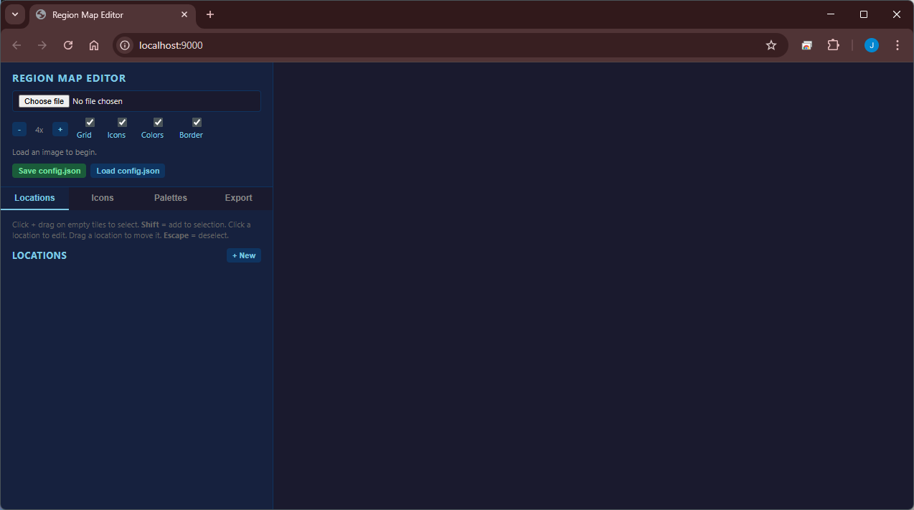
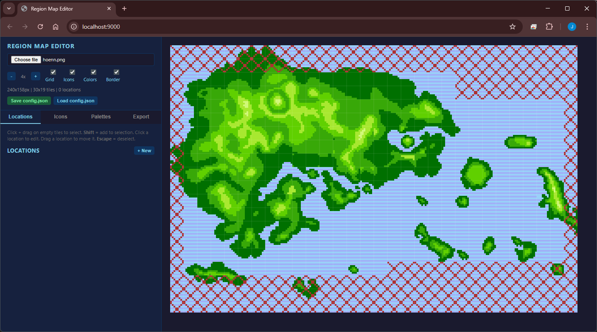
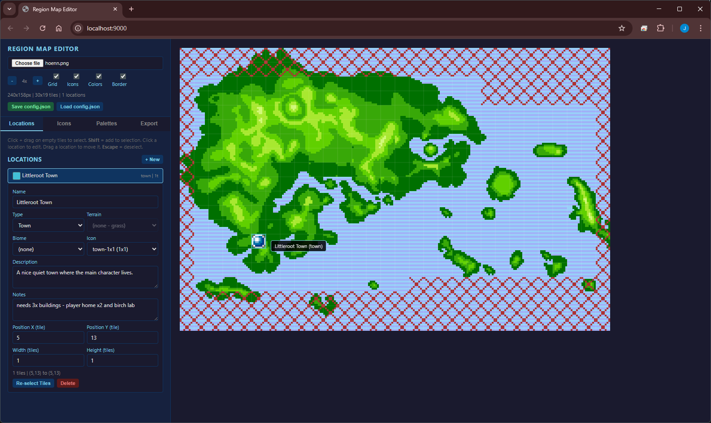
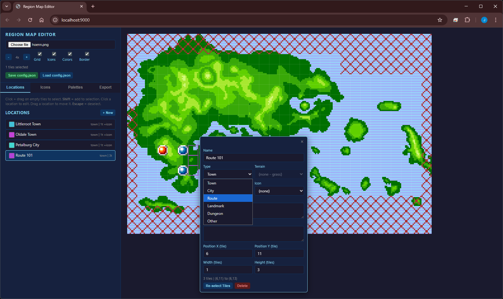
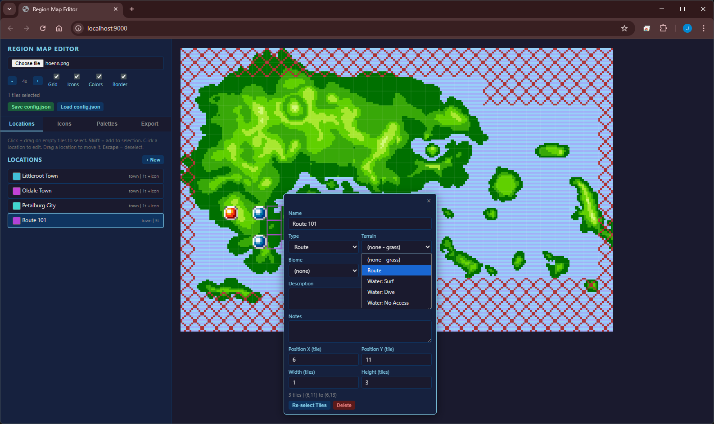
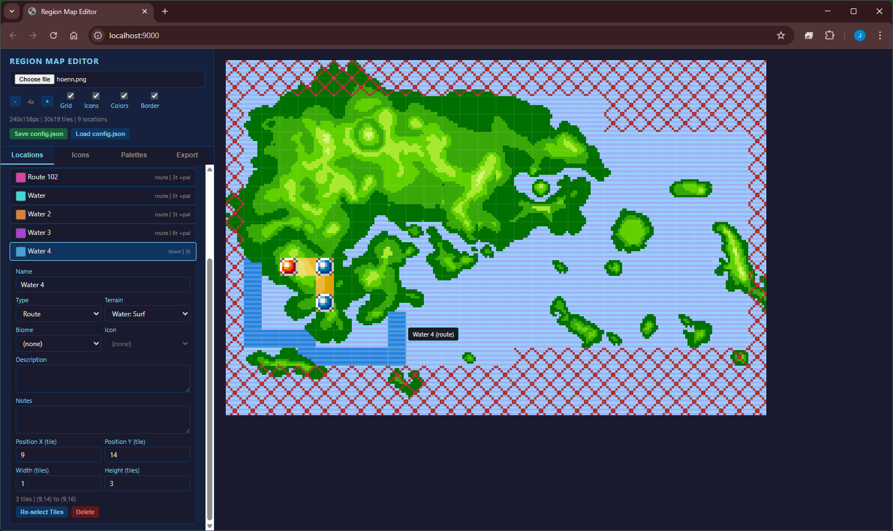
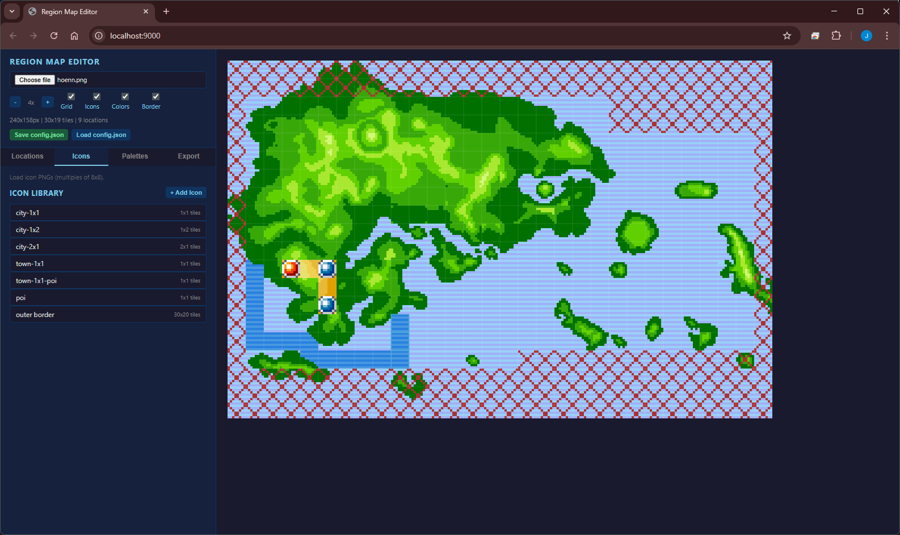
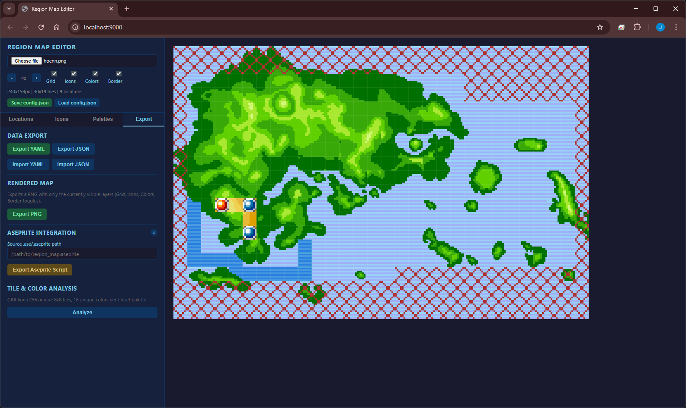

# Region Map Editor

A browser-based editor for designing GBA-style region maps (240×160px, 30×20 tiles). Built for the pokeemerald-expansion project but usable for any GBA region map work.

It is saved in `tools\region-map-editor`.

> Note: AI was used to generate most of the code for this tool!

## What it does

- Load a source PNG (indexed-color region map base image)
- Paint tile regions and assign them to named locations (towns, cities, routes, etc.)
- Apply terrain palettes: recolors grass tiles to route/desert/snow/etc., water tiles to surf/dive/no-access patterns
- Routes automatically recolor embedded water tiles using a "land route" alternating-line pattern
- Drag locations to move them; click locations in the list or on the map to edit inline
- Export the composited map as a PNG, or export location/palette data as YAML or JSON
- Generate Lua scripts for Aseprite to apply the same edits to a source .ase file
- Analyze tile and color counts against GBA limits (256 unique 8×8 tiles, 16 colors)
- Save/load full editor state as `config.json`

## How to use



1. In your command prompt, run the following commands and then open `http://localhost:9000` in your web browser.
```bash
cd tools/region-map-editor
python3 serve.py          # starts at http://localhost:8080
python3 serve.py 9000     
```



2. In the 'choose file' selector at the top, search for your file. Use the included `tools\region-map-editor\pics\hoenn.png` as an example, or use your own image. It works best with a topographic map with the standard 5 colours included in the Emerald region map for land, as well as the alternating light/dark blue for sea, but use the `Palettes` menu to modify these colours if you use something else.


3. Click and drag anywhere on the map to create a location - a location represents a town/city OR a route.




4. Add a name and set an icon in the menu (e.g. `town-1x1` for a small town). The application comes by default with all icons used in Emerald/FRLG but adding custom ones is simple (via the Icons menu).




5. Add a route by clicking and dragging on the map and creating another location, but this time change the Type to `Route`. Then, change the Terrain to `Route` (for a route primarily over land).



6. Adding a water route is essentially the same process, but change the Terrain to `Water: Surf` - or Dive for a dive route etc.

Configuration:

![palettes]tools/region-map-editor/(pics/palettes.png)


Note: You can save and reload your map config via the `Save config.json` and `Load config.json` buttons on the top of the page. This allows you to save your work and return to it if you make any changes to the map.
Press the `Export PNG` button to save your finished work to import! Follow [this tutorial](https://www.youtube.com/watch?v=tPNczMvA_l0) to insert the file once you've finished creating the map (be sure to index the colours once exported!).