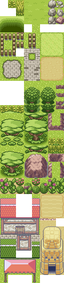
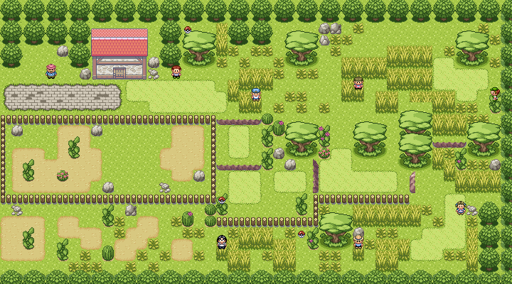

# Maps and Tilesets for pokeemerald-expansion

A collection of ready-to-use maps and tilesets for the [pokeemerald-expansion](https://github.com/rh-hideout/pokeemerald-expansion) codebase. Based off RHH's pokeemerald-expansion 1.15.0.

Each map is developed on its own branch so you can pick and choose what to merge into your project.

> Note: In addition to hand-writing it, AI has been used to generate documentation & code used for these features.

## How to Use

Each map lives on its own branch under `feature/maps-and-tilesets/`, alternatively this branch (`feature/maps-and-tilesets/all`) includes all:

| Branch | Description |
|--------|-------------|
| `feature/maps-and-tilesets/main` | Base branch (shared foundation) |
| `feature/maps-and-tilesets/` | All tilesets |
| `feature/maps-and-tilesets/prairie` | Prairie tileset and maps |
| `feature/maps-and-tilesets/swamp` | Swamp tileset and maps |

To add a map to your project, merge the relevant branch:

```bash
git remote add maps-and-tilesets <this-repo-url>
git fetch maps-and-tilesets
git merge maps-and-tilesets/feature/maps-and-tilesets/prairie
git merge maps-and-tilesets/feature/maps-and-tilesets/swamp
```

(note: merging multiple tilesets individually will likely result in simple merge errors to resolve)

## How to Modify

Tilesets are compiled using [Porytiles](https://github.com/grunt-lucas/porytiles) using the included raw files (e.g. raw-tilesets/swamp/top.png, or the Aseprite file raw-tilesets/swamp/tilesetase.aseprite). See [notes/porytiles.md](notes/porytiles.md) for setup instructions and the **Workflow** section for the edit-compile-reload cycle.

## Maps

These maps use **triple layer metatiles**. Follow the instructions at [Triple Layer Metatiles](https://github.com/pret/pokeemerald/wiki/Triple-layer-metatiles) to set this up in your project before merging.

### Prairie

A prairie/savanna/desert mesa featuring custom tiles, wild encounters, trainers, and item pickups. Includes two example maps:

- **Prairie**
- **Prairie2**

**Tileset:**



**Prairie2 Map:**



See [raw_tilesets/prairie/credits.md](raw_tilesets/prairie/credits.md) for tileset credits.

### Swamp

A murky swamp featuring custom tiles with animated water, lilypads, and swaying plants. Includes wild encounters and two example maps:

- **Swamp1**
- **Swamp2**

**Tileset:**


**Swamp Map:**


**Animations:**
- Puddle water ripples
- Lilypad bobbing
- Swamp plant/tall grass swaying
