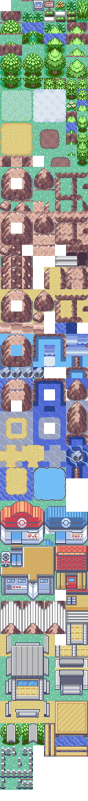

# Alternative General Primary tileset
This is a manual recreation of the Emerald Primary tileset, compatible with Porytiles for easy manipulation.

## Please note:
- These require triple layer metatiles.
- Aseprite file included for further automation using [helpfulporytiles](https://github.com/TeamAquasHideout/Team-Aquas-Asset-Repo/wiki/Porytiles-automation-with-Aseprite-CLI-and-Shell-script).
- I haven't tried adding this tileset in via the standard drag and drop method, but I suspect you can copy the general_porytiles/porytiles_bin file's contents into your codebase with minimal massaging required.
- There are some tiles that weren't included from the base Emerald tileset like the white fences, secret bases entries, some rocks used in the ocean, and the bumpy slope/rails used for the Acro Bike. These can easily be added in if you swap out others.
- This is not a plug and play replacement for the existing general tileset, and your existing maps will break without replacing tiles. Many tiles have changed positions. `porytiles_source_files/oldtonewmapping.csv` is a mapping file that lists many but not all old metatile ids, and their new position.

## Features:
- All tileset animations are included (I think!?), specifically the ocean water tile animations, pond animations and waterfall animations.
- New additions include Rock Climb tiles, new trees (one large, two small), one new animated flower, sideways & north-facing stairs, and an omnidirectional gate house.
- If you use [metatile expansion](https://github.com/pret/pokeemerald/wiki/Expanding-The-Metatile-Count), you can fit more tiles in. See my tilesetase_expanded.png file for an example of a few more (a bridge & the standard white fence) that weren't able to make the cut for the base tileset.

## Credits
- The tileset is primarily Emerald's General tileset
- White animated flows: fisham33
- Trees: skidmarc25, thedeadheroalistair
- Rock climb tiles: fisham33
- Sideways stairs: thedeadheroalistair
- Route gate: pulled from Fire Red w/ minimal changes